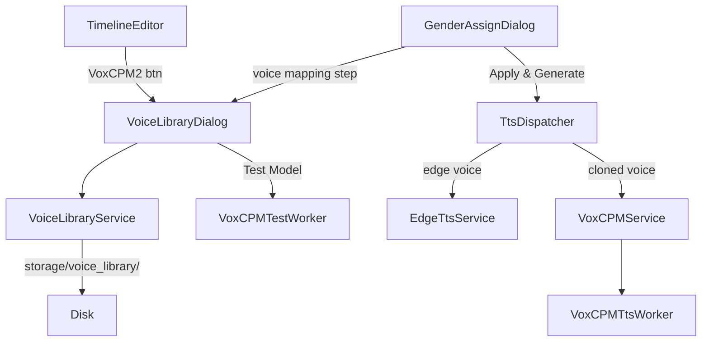

# VoxCPM2 Voice Cloning Integration

## Architecture Overview



## New Files

### `services/voxcpm_service.py`

Wraps `pip install voxcpm`. Key methods:

- `is_package_installed() -> bool` — checks `importlib.util.find_spec("voxcpm")`
- `is_model_downloaded() -> bool` — checks HF cache for `openbmb/VoxCPM2`
- `load_model()` — lazy-loads `VoxCPM.from_pretrained("openbmb/VoxCPM2")`
- `synthesize(text, output_path, reference_wav=None, prompt_wav=None, prompt_text=None) -> str` — calls `model.generate(...)` + `soundfile.write`; uses Controllable Cloning when `reference_wav` given, plain TTS otherwise
- `quick_test() -> dict` — synthesizes a short Khmer phrase, returns `{success, rtf, vram_gb, error}`

### `workers/voxcpm_tts_worker.py`

`QThread` wrapping `VoxCPMService.synthesize` for a list of segments. Emits same signals as `TtsWorker` (`progress_changed`, `finished`, `failed`) so callers are interchangeable.

### `services/voice_library_service.py`

Manages `storage/voice_library/`:

- `index.json` — list of `{id, name, gender, wav_path, created_at}`
- `add_sample(name, gender, src_wav) -> VoiceEntry` — copies WAV, saves index
- `list_entries() -> list[VoiceEntry]`
- `delete_entry(id)`
- `get_wav_path(id) -> Path`

### `ui/components/voice_library_dialog.py`

Single dialog with two tabs:

**"Voice Library" tab**

- List of saved samples (name, gender badge, duration, Play / Delete buttons)
- "Import Voice Sample" button → file picker (WAV/MP3) → name + gender form → saves via `VoiceLibraryService`
- Double-click to preview via `QMediaPlayer`

**"Test VoxCPM2" tab**

- Hardware info panel: GPU name, VRAM, CUDA version, `voxcpm` package present/absent
- "Run Model Test" button → spawns `VoxCPMTestWorker` → progress bar → result (RTF, sample audio player)
- Clear pass/fail verdict (e.g. "Your GPU has 8 GB VRAM — VoxCPM2 should run")
- "Install package" button runs `pip install voxcpm` in a subprocess if not installed

## Modified Files

### [`app/paths.py`](app/paths.py)

Add `VOICE_LIBRARY_DIR = STORAGE_DIR / "voice_library"`.

### [`ui/components/timeline_editor.py`](ui/components/timeline_editor.py)

Add a `VoxCPM2` `AppButton` (variant `"purple"`, icon `microphone`) to the controls bar, emitting a new signal `voice_library_requested`. Wire it in `editor_layout.py` to open `VoiceLibraryDialog`.

### [`ui/components/gender_assign_dialog.py`](ui/components/gender_assign_dialog.py)

Add a **"Voice Mapping" section** below the segment table (visible after gender is assigned):

```
Male voice:    [dropdown: Edge TTS – Piseth | <cloned voices tagged male>]
Female voice:  [dropdown: Edge TTS – Sreymom | <cloned voices tagged female>]
               [Open Voice Library…]
```

- Dropdowns populated from `VoiceLibraryService.list_entries()` filtered by gender + Edge TTS options
- On "Apply & Generate Voice": each segment's `seg.voice` is set to the mapped value (`"edge:Piseth (Male)"` or `"clone:<voice_id>"`)
- Gender assignment itself is unchanged — it still auto-detects and lets the user override per row

### [`workers/tts_worker.py`](workers/tts_worker.py) → new `services/tts_dispatcher.py`

Extract a `TtsDispatcher` that reads `seg.voice` and routes:

- Prefix `"edge:"` → `EdgeTtsService` (existing)
- Prefix `"clone:<id>"` → `VoxCPMService` with the library WAV as `reference_wav`
- Fallback: Edge TTS

`TtsWorker` becomes a thin wrapper around `TtsDispatcher`.

## Workflow After Changes

```
1. User clicks "Generate Voice" in toolbar
2. GenderAssignDialog opens:
   a. Auto-assign gender per segment (unchanged)
   b. User adjusts genders if needed (unchanged)
   c. NEW: "Voice Mapping" section — pick male voice + female voice
      (Edge TTS defaults; cloned voices appear if any saved)
   d. "Apply & Generate Voice" → writes seg.voice for each segment
3. TtsDispatcher processes each segment:
   - edge: → EdgeTtsService (fast, no GPU needed)
   - clone: → VoxCPMService (high quality, GPU recommended)
4. Timeline and dubbed player rebuild as before
```

## Hardware / Dependency Notes

- VoxCPM2 requires ~8 GB VRAM; `quick_test()` reports this clearly
- CPU fallback is possible but slow; the Test dialog warns the user
- `voxcpm` package is NOT added to `requirements.txt` as a hard dependency — it is optional, installed on demand from the Test dialog or settings
